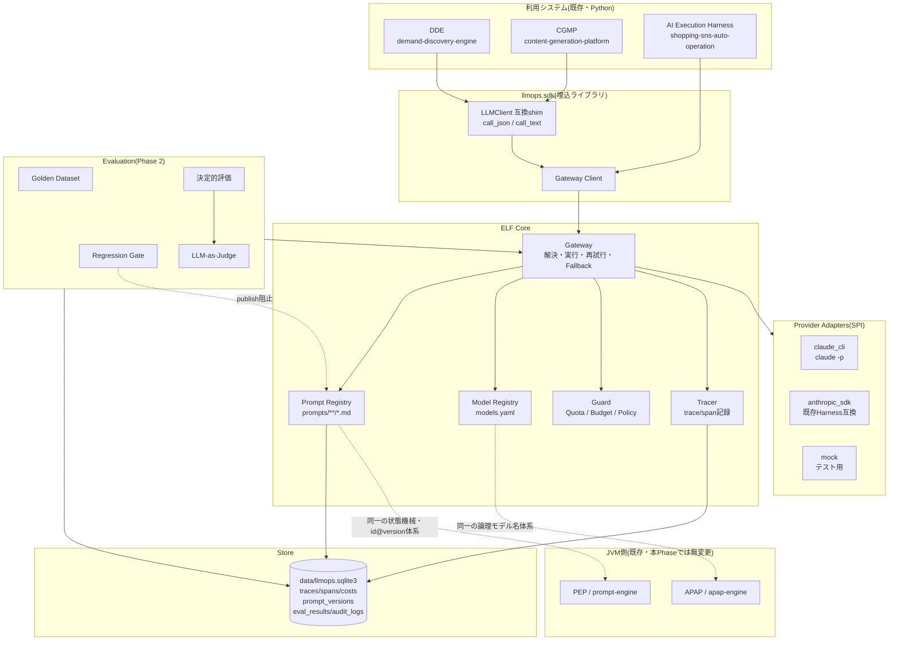
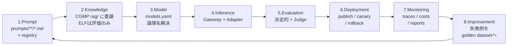
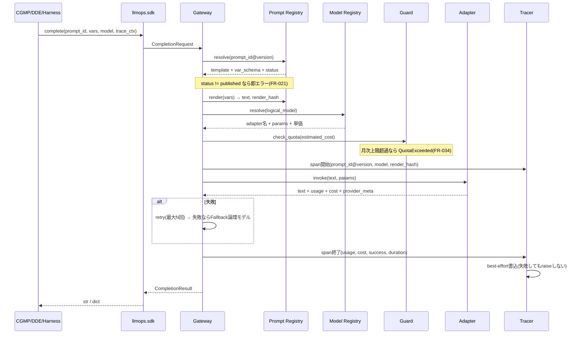
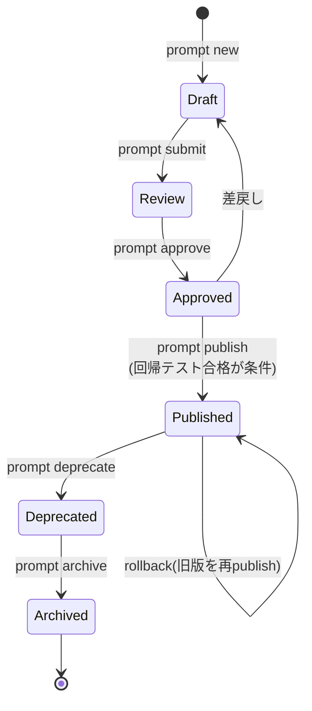
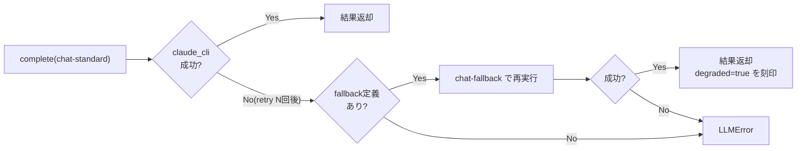

# 基本設計書 — Enterprise LLMOps Framework(ELF)

v1.0 / 前提: `01_要件定義.md`

---

## 1. 設計方針

### 1.1 ELF は Control Plane であり Application ではない

既に5システムが動いている環境に6個目のアプリを足すのではなく、**既存5システムの内側に入る薄い層**として設計する。

```
従来:  [DDE] --subprocess--> claude -p
       [CGMP] --subprocess--> claude -p      ← client.py がコピー重複
       [Harness] --SDK--> Anthropic API

ELF後: [DDE]     \
       [CGMP]     >-- llmops.sdk --> Gateway --> Adapter --> claude -p / SDK / mock
       [Harness] /                      |
                                        +--> Prompt Registry(prompts/**/*.md)
                                        +--> Model Registry(models.yaml)
                                        +--> Trace Store(llmops.sqlite3)
```

### 1.2 3つの設計原則

| 原則 | 内容 | 根拠 |
|---|---|---|
| **既存を壊さない** | 既存DBスキーマ無変更、互換shim提供、ELF未導入でも既存は動く | 5システムが長期テスト中であり、回帰が最大のリスク |
| **再発明しない** | APAPにある機能(Routing/Cache/Cost/CB)はPython側で最小実装に留め、契約のみ一致させる | 19章 §15「疎結合」/ JVM側との将来統合 |
| **記録は絶対に落とさない** | Trace記録の失敗でアプリ処理を止めない(best-effort書き込み + WALモード) | NFR-02 / CGMP絶対ルール8の強化版 |

---

## 2. システム構成



---

## 3. LLMOps ライフサイクルのマッピング `[§2]`

19章設計書の8ステージが、本実装のどこに当たるか。



**閉ループの実装上の要**: ステージ8は「本番で失敗した入出力を `llmops eval add-case` でゴールデンデータセットに追加する」CLI操作として実装する。ここが自動化されないとループは回らない。

---

## 4. モジュール構成

```
src/llmops/
├── cli.py                  Typer エントリポイント(llmops コマンド)
├── config.py               config.yaml ローダ(pydantic)
├── models.py               DTO(dataclass)
├── logging_utils.py        構造化ログ(trace_id 付き)
│
├── gateway/
│   ├── gateway.py          Gateway本体。resolve → guard → execute → trace
│   ├── resolver.py         論理モデル名 → Provider/Adapter 解決
│   ├── retry.py            再試行・Fallback(指数バックオフ)
│   └── errors.py           LLMError / QuotaExceeded / PromptNotPublished 等
│
├── adapters/
│   ├── base.py             ProviderAdapter SPI(抽象基底)
│   ├── claude_cli.py       claude -p --output-format json
│   ├── anthropic_sdk.py    Anthropic SDK(optional extra。Harness互換)
│   └── mock.py             決定的な固定応答(テスト用)
│
├── prompt/
│   ├── registry.py         読込・解決・状態遷移
│   ├── loader.py           Markdown + YAML front matter パース
│   ├── render.py           変数展開・スキーマ検証・render_hash 算出
│   └── catalog.py          一覧・検索・棚卸
│
├── registry/
│   └── model_registry.py   models.yaml ローダ・論理名解決・版管理
│
├── observability/
│   ├── tracer.py           trace/span 記録(best-effort)
│   ├── cost.py             コスト集計・予算判定
│   └── report.py           Markdownレポート生成
│
├── guard/
│   ├── quota.py            Hard Quota(月次・実行単位)
│   └── policy.py           Policy評価・audit記録
│
├── eval/                   (Phase 2)
│   ├── runner.py           スイート実行
│   ├── deterministic.py    スキーマ/禁止語/長さ/JSON妥当性
│   ├── judge.py            LLM-as-Judge(Judge自身もRegistry管理)
│   ├── groundedness.py     RAG出力のcontext帰属検証
│   └── regression.py       ベースライン比較・劣化判定
│
├── governance/             (Phase 3)
│   ├── catalog.py          AI資産台帳
│   ├── deploy.py           publish / canary / rollback
│   └── audit.py            監査ログ
│
├── db/
│   ├── schema.sql          DDL
│   ├── connection.py       SQLite接続(WAL・外部キー有効)
│   └── repository.py       全DB操作の集約(リポジトリパターン)
│
└── sdk/
    ├── client.py           利用側が import する公開API
    └── compat.py           既存 LLMClient 互換shim(FR-013)
```

**依存の向き**: `sdk` → `gateway` → (`prompt`/`registry`/`guard`/`observability`) → `db` / `adapters`。逆向き依存を作らない。`adapters/*` は `gateway` を import しない(SPIのみ参照)。

---

## 5. 主要な処理フロー

### 5.1 推論1回のシーケンス



### 5.2 Prompt 変更〜公開のフロー(評価ゲート)



`publish` は以下を全て満たす場合のみ成功する(満たさない場合は非ゼロ終了):

1. 状態が `approved` であること
2. 対応する評価スイートが存在し、直近の実行が**現在のコミット内容に対して**行われていること
3. ベースライン(現Published版)比でスコア劣化が閾値以内であること
4. 決定的評価(スキーマ・禁止語)が全件合格であること

状態機械はPEPと同一にする。将来PEPへ資産を移す際、状態の対応表を書かずに済ませるため。

### 5.3 Fallback の設計 `[§12]`



Fallback結果には `degraded=true` を span に刻印する。品質レポートで「縮退実行で生成されたコンテンツ」を後から識別できるようにするため。

---

## 6. データ設計概要

詳細は `03_詳細設計.md` §2。テーブルの役割のみ示す。

| テーブル | 役割 | 対応要件 |
|---|---|---|
| `traces` | 論理的な1処理単位(記事1本の生成など) | FR-030 |
| `spans` | LLM呼び出し1回。prompt版・モデル・usage・costを保持 | FR-030-032 |
| `prompt_versions` | Prompt資産の版と状態(PEP互換の状態機械) | FR-020-021 |
| `prompt_deployments` | 現在Publishedな版へのポインタ + canary割合 | FR-050-051 |
| `model_versions` | 論理モデル名→Adapter/パラメータ/単価の版管理 | FR-011 |
| `budgets` / `cost_daily` | 予算定義と日次集計 | FR-034 |
| `eval_suites` / `eval_cases` / `eval_results` | 評価資産と結果 | FR-040-044 |
| `asset_catalog` | AI資産台帳(所有者・用途・最終利用日) | FR-052 |
| `audit_logs` | Policy違反・状態遷移・公開操作の証跡 | FR-053 |

**既存システムのDBには触らない**。CGMPの `llm_logs` は当面併存させ、Phase 1完了後に「ELFの `spans` が上位互換である」ことを確認してからCGMP側の記録を停止する(移行手順は `05_既存システム統合.md`)。

---

## 7. 設定ファイル構成

| ファイル | 内容 | 変更頻度 |
|---|---|---|
| `config.yaml` | パス・再試行回数・タイムアウト・予算・ログレベル | 低 |
| `models.yaml` | 論理モデル定義(→Adapter、パラメータ、単価、fallback先) | 中 |
| `prompts/**/*.md` | Prompt本体(YAML front matter + 本文) | 高 |
| `evals/**/*.yaml` | 評価スイート定義 | 中 |

**閾値・重み・上限をコードに書かない**(CGMP絶対ルール7を継承)。

---

## 8. 段階実装(Phase)

| Phase | スコープ | 完了条件 |
|---|---|---|
| **1** | Gateway / Model Registry / Prompt Registry / Trace / Cost / 互換shim | CGMPが `llm/client.py` を捨ててELF経由で動き、既存テストが全て通る。`spans` にcost/tokenが記録される |
| **2** | Evaluation / Regression / 決定的評価 / Judge / Groundedness | `llmops prompt publish` が評価ゲートで失敗しうる状態になる。CGMPのoutline/sectionのスイートが存在する |
| **3** | Governance / 資産台帳 / canary / rollback / 監査 / レポート拡充 | 全AI資産に所有者が付き、未使用資産が棚卸できる。rollbackが1コマンドで済む |
| **4**(将来) | JVM側統合(PEPへPrompt資産を寄せる / APAPをAdapter化) | 本Phaseでは設計の契約一致まで。実装は対象外 |

各Phaseの完了条件を満たすまで次に進まない(DDE/CGMPと同じ運用)。

---

## 9. 設計上のトレードオフと採否

| 論点 | 採用 | 却下案と理由 |
|---|---|---|
| ELFの言語 | Python | **Kotlin**: JVM側と揃うが、統合対象のうち3/5がPythonで、そこが最も課題を抱えている。移行コストが利益を上回る |
| Gatewayの形態 | 埋込ライブラリ(`import llmops`) | **常駐HTTPサーバ**: APAP gatewayと同形だが、利用者1名・CLIバッチ中心の環境でプロセス常駐は運用負債。将来必要になれば同じCoreをサーバで包める設計にする |
| Prompt保管形式 | Markdown + YAML front matter(ファイル) | **DBのみ**: Gitで差分レビューできない。Prompt変更のレビュー(§4.2)が成立しない。DBは版・状態・ハッシュのみ持つ |
| 既存DBの扱い | ELF専用DBを新設 | **既存DBに相乗り**: 3システムのDBが別々で、横断集計ができない。またスキーマ変更が回帰リスク |
| Trace記録の失敗時 | best-effort(握り潰してログ出力) | **例外送出**: 観測が本体の可用性を下げるのは本末転倒。ただし記録失敗自体は必ずログに出す |
| APAPとの関係 | 契約一致のみ(Python側は最小実装) | **APAPをHTTP経由で呼ぶ**: JVMプロセス常駐が必要になり、Python CLIバッチの前提が崩れる |
| 評価のJudge | 論理モデル名 `judge` で分離 | **本番と同じモデルを流用**: 自己評価バイアスが入る。分離しておけば将来別Providerに差し替えられる |

---

## 10. アンチパターン(本実装で明示的に避けるもの)

| アンチパターン | 本設計での防止策 |
|---|---|
| ELFが6個目のモノリスになる | Control Planeに限定。RAG本体・Agent実行・パイプライン制御は既存に委譲(§1.3 要件定義) |
| Gatewayがただのプロキシになる | Prompt解決・Quota・Trace・Fallbackを必ず通す。素通しAPIを公開しない |
| 移行が終わらず新旧併存が恒久化する | Phase 1完了条件に「CGMPの `llm/client.py` 削除」を含める。併存は移行期間のみ |
| Prompt Registryを作ったのにハードコードが残る | `tests/test_no_hardcoded_prompts.py` でgrep的検査をCIに入れる |
| 評価スイートが陳腐化する | 本番失敗例の追加を運用ルーチン(週次)に組み込む(`04_運用ガイド.md`) |
| コストを記録するだけで止めない | Hard Quotaを既定で有効にする。記録と制御を同時に入れる |
