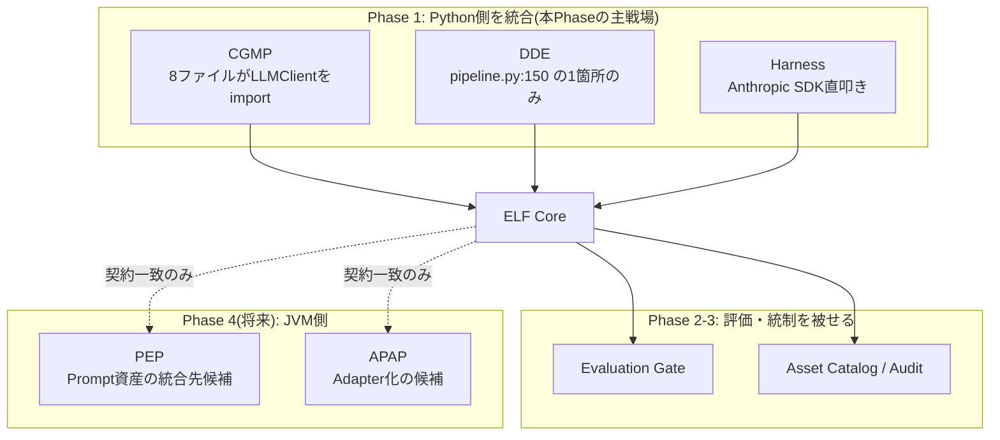
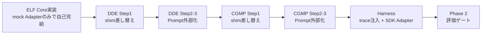

# 既存システム統合・移行設計 — ELF

v1.0 / 前提: `01_要件定義.md` `02_基本設計.md` `03_詳細設計.md`

本書は **実在する5システムのコードを調査した結果に基づく**。ファイルパス・行番号・シンボル名は調査時点(2026-09)の実コードを指す。

---

## 1. 統合マップ



---

## 2. CGMP の統合(最大の作業量・最大の効果)

### 2.1 現状の依存箇所

`LLMClient` / `LLMBudgetExceeded` / `LLMError` を import しているファイル:

| ファイル | 用途 | 対応 |
|---|---|---|
| `src/cgmp/pipeline.py:18,58,84` | `LLMClient(config, repo)` を生成しDI | **注入点**。ここを差し替えると下流は無変更で動く |
| `src/cgmp/publish/service.py:37,80,101` | 同上(publish経路の生成) | 注入点 |
| `src/cgmp/outline/generator.py:20-21,90` | outline生成 | Phase 1後半でprompt_id化 |
| `src/cgmp/writer/section_writer.py:19-20,56` | section生成 | 同上 |
| `src/cgmp/writer/closing_writer.py:15-16,47` | 締め生成 | 同上 |
| `src/cgmp/quality/rubric.py:22,123` | LLM品質評価 | 同上(Phase 2でeval側へ寄せる候補) |
| `src/cgmp/formatter/sns.py:18-19,156` | SNS要約 | 同上 |
| `src/cgmp/cli.py:25` / `src/cgmp/scheduler/jobs.py:28` | `LLMBudgetExceeded` の捕捉 | **例外名を維持するため無変更** |

依存が `LLMClient` 型注釈と2つの生成箇所に集中している。**互換shimが効く構造**になっている(既存設計が良い)。

### 2.2 移行手順(3ステップ・各ステップで既存テストが通ること)

#### Step 1: 互換shim差し替え(コード変更は2行)

```python
# src/cgmp/pipeline.py, src/cgmp/publish/service.py
- from cgmp.llm.client import LLMBudgetExceeded, LLMClient
+ from llmops.sdk.compat import LLMBudgetExceeded, LLMClient   # ELF経由
```

`config.yaml` に追記:

```yaml
llmops:
  enabled: true
  config_path: "../enterprise-llmops-framework/config.yaml"
  system: cgmp
```

この時点で得られるもの:
- 全LLM呼び出しが ELF の `spans` に記録される
- `total_cost_usd` / `usage` / `session_id` / `num_turns` が保存される(C-03解消)
- 呼び出し回数上限(絶対ルール3)がELFのGuard側でも二重に効く

まだ得られないもの: Prompt版の刻印(prompts.py がまだ文字列を渡しているため `prompt_id=NULL` のadhoc spanになる)。

**検証**: `pytest -q` が全て通ること。`sqlite3 data/llmops.sqlite3 "SELECT task,cost_usd,input_tokens FROM spans LIMIT 5;"` に値が入ること。

#### Step 2: Prompt の外部化(C-01解消)

Prompt文字列は `llm/prompts.py` だけでなく**3ファイルに分散している**(調査結果)。全てを `prompts/cgmp/*.md` へ移す。

| 現在の定義場所 | 移行先 | prompt_id |
|---|---|---|
| `llm/prompts.py:132` `outline_prompt()` | `prompts/cgmp/outline.md` | `cgmp.outline` |
| `llm/prompts.py:194` `section_prompt()` | `prompts/cgmp/section.md` | `cgmp.section` |
| `llm/prompts.py:253` `closing_prompt()` | `prompts/cgmp/closing.md` | `cgmp.closing` |
| **`quality/rubric.py:71` `rubric_prompt()`** | `prompts/cgmp/rubric.md` | `cgmp.rubric` |
| **`formatter/sns.py:84` `sns_prompt()`** | `prompts/cgmp/sns_summary.md` | `cgmp.sns_summary` |

**共有ルール断片**(`llm/prompts.py` の以下)は fragment として切り出す(`03_詳細設計.md` §3.2):

| 種別 | シンボル | 扱い |
|---|---|---|
| 固定文字列(6件) | `NO_CONTEXT` `CONTEXT_RULE` `NO_HALLUCINATION_RULE` `TIME_SENSITIVE_RULE` `PROMOTION_RULE` `EXCEPTION_RULE` `STYLE_RULES` | `prompts/_fragments/*.md` に置き、front matter の `includes:` で参照 |
| パラメータ付き(2件) | `term_rule(variants)` `tone_rule(tone, tone_label)` | **fragment にしない**。呼び出し側で文字列を組み立て、通常の変数として渡す(テンプレートに制御構文を入れないため) |
| 内部定数 | `_TONE_EXAMPLES` `_evidence_block()` `_phrase_list()` `_jdump()` | Python側に残す(データ整形であり Prompt ではない) |

**注意**: `rubric.py` と `sns.py` はPrompt定義と後処理ロジック(スコア変換・文字数計算・ハッシュタグ整形)が同居している。
移すのは**Prompt文字列だけ**で、後処理ロジックはCGMP側に残す。

**移行の正しさをどう担保するか**(ここが移行で最も危険な箇所):

1. 移行前に、現行 `prompts.py` の各関数へ代表入力を与えて出力文字列を**ゴールデンファイルとして保存**する
2. 移行後、同じ入力で `llmops prompt render` した結果が**バイト一致**することをテストする
3. 一致を確認してから呼び出し側を `ops.complete(prompt_id=...)` に切り替える

文言を「ついでに改善」しないこと。改善は移行完了後、評価スイート(Phase 2)を用意してから行う。

呼び出し側の変更例:

```python
# src/cgmp/writer/section_writer.py
- from cgmp.llm.prompts import section_prompt
- body = llm.call_text(section_prompt(request, outline, section, context), task="section", ...)
+ body = ops.complete(
+     prompt_id="cgmp.section",
+     variables={"title": request.title, "section_heading": section.heading,
+                "context": context, "terminology": terms, "max_chars": limit},
+     task="section",
+ ).text
```

**検証**: 既存のセクション生成テストが通り、`spans.prompt_id='cgmp.section'` と `render_hash` が記録されること。

#### Step 3: 旧実装の削除

- `src/cgmp/llm/client.py` を削除
- `src/cgmp/llm/prompts.py` を削除
- `config.yaml` の `llm:` セクションを削除(設定は `models.yaml` へ移動済み)
- `llm_logs` テーブルは**残すがINSERTを停止**する(過去データの参照のため。Phase 3で `spans` への移行スクリプトを用意)
- `CLAUDE.md` の「LLM呼び出しパターン(llm/client.py)」節を ELF 参照に書き換える

**Phase 1の完了条件**: `grep -rn 'subprocess.run(\["claude"' src/` が0件。

### 2.3 CGMP の絶対ルールとELFの対応

| CGMP絶対ルール | ELFでの扱い |
|---|---|
| 1. 有料API禁止 | ELFも同じ制約。`models.yaml` の既定は `claude_cli` のみ。`anthropic_sdk` はoptional extraで、未インストール時は解決不能エラー |
| 3. 1記事10回以内 | `guard.calls_per_trace_limit: 10`。trace単位で強制。`LLMBudgetExceeded` を維持 |
| 6. 決定的判定を先に | ELFの `eval.deterministic_first: true` が同方針。品質チェック本体はCGMP側に残す |
| 7. 閾値をconfigから | ELFも同様。`config.yaml` / `models.yaml` / front matter |
| 8. 入出力全文をllm_logsへ | `spans.request_text` / `response_text` が上位互換。Step 3までは二重記録 |
| 9. contextに無い情報を書かせない | Prompt front matter の `constraints.forbid_outside_context: true` として宣言し、Phase 2の `groundedness` 評価が検証する |
| 12. 確認質問をしない | ELFも同じ。`NOTES.md` に判断を記録 |

---

## 3. DDE の統合(最小工数)

注入点が `src/dde/pipeline.py:150` の1箇所のみ。

```python
- from dde.llm.client import LLMClient
+ from llmops.sdk.compat import LLMClient
  ...
  client = LLMClient(config=config, repo=repo, system="dde")
```

`src/dde/llm/batch.py`(380行)は**50件バッチ処理のロジック**であり、ELFの責務ではない。`BatchProcessor` はそのまま残し、内部の `LLMClient` 呼び出しだけがELF経由になる。

Prompt外部化は3件のみ。CGMPと違い全て `llm/prompts.py` に集約されている。

| 現在の定義 | 移行先 | prompt_id |
|---|---|---|
| `EXPAND_TEMPLATE`(13行目)+ `build_expand_prompt()` | `prompts/dde/expand.md` | `dde.expand` |
| `CLASSIFY_TEMPLATE`(30行目)+ `build_classify_prompt()` | `prompts/dde/classify.md` | `dde.classify` |
| `CLUSTER_NAMING_TEMPLATE`(73行目)+ `build_cluster_naming_prompt()` | `prompts/dde/cluster_naming.md` | `dde.cluster_naming` |

`build_*_prompt()` は既に「テンプレート + 変数埋め込み」の形になっており、ELFのレンダラと構造が同じ。
**DDEは移行が最も素直なため、ここで手順(ゴールデンファイルによるバイト一致検証)を確立してからCGMPへ進む。**

---

## 4. AI Execution Harness の統合

`Python/shopping-sns-auto-operation/backend/` 配下。

### 4.1 現状評価

| 観点 | 現状 | ELF適用 |
|---|---|---|
| Prompt管理 | `backend/prompts/{generator,evaluator,learning}/*-v1.txt` として**既にファイル化・版付き**。5システム中で最も進んでいる | front matter を足して `prompts/harness/*.md` 形式へ寄せる。`gen-v1.txt` → `harness.generator@1` |
| LLM呼び出し | Anthropic SDK 直接 | `adapters/anthropic_sdk.py` 経由にする |
| Cost管理 | `app/harness/cost_guard.py` が月次上限を独自実装 | **cost_guard は残す**。ELFの `budgets` はHarnessを含む横断予算として上位に置き、二重防御にする |
| 承認ゲート | `app/harness/pipeline.py` の `waiting_approval` 状態 | ELFは関与しない(19章 §7 の HITL は Harness の実装を正とする) |
| パイプライン状態 | `job_queue.py` + DB | ELFは関与しない。`trace` として観測するのみ |

### 4.2 統合方針

Harness は**ELFの利用者であると同時に、19章 §7 Agent Lifecycle の参照実装**として扱う。ELFがHarnessの機能を吸収するのではなく、`ops.trace("pipeline.daily")` でパイプライン全体を1 traceとして観測し、各Agent呼び出しをspanとして記録する。

```python
# backend/app/harness/pipeline.py(概念)
with ops.trace("pipeline.daily", external_id=run_id) as tr:
    for step in pipeline.steps:
        with tr.child(step.name):
            step.run()
```

**注意**: Harness は有料API(Anthropic SDK)を使う唯一のシステム。ELFの予算機能はここで実質的な意味を持つ。`budgets` に `scope='system', id='harness'` を必ず設定する。

---

## 5. JVM側(PEP / APAP)との契約一致

**本Phaseでは Kotlin コードを1行も変更しない。** 合わせるのは契約のみ。

| 契約 | PEP/APAP側 | ELF側 | 一致させる理由 |
|---|---|---|---|
| Prompt状態機械 | Draft→Review→Approved→Published→Deprecated→Archived | 同一(`prompt_versions.status`) | 将来PEPへ資産を移す際、状態対応表が不要になる |
| Prompt識別子 | `id@version` | 同一 | 実行ログの互換 |
| renderHash | PEP `tests/prompt-regression` の決定性検証 | SHA-256先頭16桁で同一定義 | 同一Promptの同一性をシステム跨ぎで判定できる |
| 論理モデル名 | APAPの論理モデル体系 | `models.yaml` の `logical_name` | 将来ELFのAdapterをAPAP委譲に差し替えても、アプリ側が無変更で済む |
| Vendor Neutral | APAP規約「コード・設定・コメントに特定Provider名/製品名/モデル名を書かない」 | 同規約を採用(実モデル名は環境変数) | Konsistテスト相当の検査をPython側にも置く |

### 5.1 Phase 4(将来)の選択肢と現時点の判断

| 選択肢 | 内容 | 現時点の評価 |
|---|---|---|
| A. ELFのAdapterをAPAP委譲にする | `adapters/apap_http.py` を足し、APAP gatewayをHTTPで呼ぶ | JVMプロセス常駐が必要。CLIバッチ前提が崩れるため**現時点では採らない**。契約は合わせてあるので後から追加可能 |
| B. Prompt資産をPEPへ寄せる | Python側RegistryをPEPのクライアントにする | PEPがSpring Boot常駐。同上の理由で保留。front matterからPEPの登録形式への変換スクリプトだけ用意しておく |
| C. 現状維持(契約一致のみ) | Python側は自前、JVM側は自前、契約だけ同一 | **採用**。5システムが長期テスト中の現在、統合による回帰リスクが利益を上回る |

この判断は `NOTES.md` に記録し、JVM側の長期テストが終わった時点で再評価する。

---

## 6. 移行順序とリスク



| リスク | 影響 | 緩和策 |
|---|---|---|
| 移行でPrompt文言が変わり生成品質が変化する | 高(長期テスト中のデータが汚れる) | ゴールデンファイルによるバイト一致検証(§2.2 Step 2)。改善を同時に行わない |
| ELFのDB書き込み失敗でアプリが止まる | 高 | best-effort書き込み(NFR-02)。`ELF_STRICT_TRACE` はテスト時のみ |
| shimの挙動差分で既存テストが落ちる | 中 | `strip_fence` / `extract_json` を既存実装からそのまま移植。改善しない |
| 移行が途中で止まり新旧併存が恒久化する | 中 | Phase 1完了条件に旧ファイル削除を含める。`allow_raw_completion` を移行後にfalseへ戻す |
| ELFのDBが肥大化する | 低 | `request_text`/`response_text` に `max_text_chars` 上限。Phase 3で保持期限とアーカイブを実装 |
| 相対パス依存(`../enterprise-llmops-framework`)が壊れる | 低 | `ELF_CONFIG` 環境変数を優先。config_pathは補助 |

---

## 7. 統合後に初めて可能になること

移行の価値を測る指標。Phase 1完了時点で以下が全て実行できるようになる。

```bash
# 3システム横断のコスト内訳(現在はそもそも取得不能)
llmops report cost --since 30d --by system

# 「この記事はどのPrompt版・どのモデルで生成されたか」
llmops trace show <cgmp_request_id>

# Prompt変更の影響を、本番に出す前に見る
llmops prompt diff cgmp.section 3 4
llmops eval run cgmp-section --baseline

# 縮退実行(Fallback)で作られたコンテンツの洗い出し
sqlite3 data/llmops.sqlite3 "SELECT trace_id,task FROM spans WHERE degraded=1;"

# 本番で失敗した入出力を、そのまま回帰テストケースにする(閉ループ)
llmops eval add-case cgmp-section --from-span <span_id>
```
